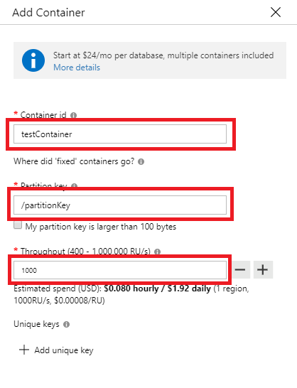
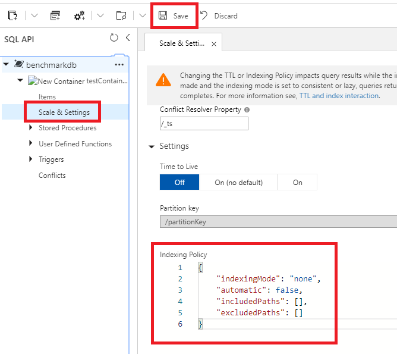
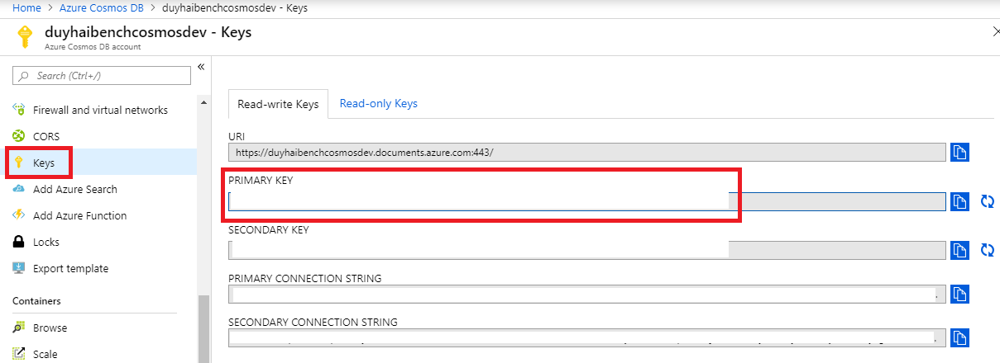

# Code to benchmark CosmosDB using Java SDK

## Preparing CosmosDB account

* Create a CosmosDB account
* Create a CosmosDB database
* Create a CosmosDB container with a **provisioned throughput** and a **partition key**



* Open the `Scale & Settings` menu on the container and set the indexing policy. Do not forget to click on `Save`



* Disable all indexing with the following json payload  
```json
{
    "indexingMode": "none",
    "automatic": false,
    "includedPaths": [],
    "excludedPaths": []
}
```

* Retrieve the database **master key**


## Preparing Injector VM

* Ensure you have a subnet with Service Endpoint `Azure.CosmosDB` enabled to avoid going through the CoreTech firewall
* Create a VM with OS Ubuntu 16.04 LTS
* Connect to the VM and execute the following shell commands to configure it

```bash
#Switch to root
sudo su - 

#Update /etc/hosts with your own hostname
echo "127.0.0.1 <hostname>" >> vim /etc/hosts

#Increase the number of open files
echo "* - nofile 100000" >> /etc/security/limits.conf 

#Install utilities for monitoring
apt-get install -y openjdk-8-jre-headless nmon htop openssl libapr1 dstat
```

* Restart the VM


## Launching the benchmark

* Build the fat jar with `mvn clean package`
* Go to `<project_folder>\target` and ship the file `benchmarkRunner-1.jar` to the injector VM
* Set all the parameters for injection as follow
```bash
export INSTANCE_URL=<your_cosmosdb_instance_url_in_https_with_port>
export MASTERKEY=<secret_CosmosDB_account_master_key>
export DATABASE=<your_database_name>
export COLLECTION=<your_collection_name>
export DURATION_IN_MINUTES=10
export STATS_INTERVAL_IN_SECS=10
export DOC_SIZE_IN_KB=1
export DISTINCT_DOCS_COUNT=10000
export INJECTOR_COUNT=<parallel_injector_count>
export CONCURRENCY=<concurrency_level>
```  

| Parameter                | Explanation                                                     |
|--------------------------|-----------------------------------------------------------------|
| DURATION_IN_MINUTES      | Test duration in minutes                                        |
| STATS_INTERVAL_IN_SECS   | Print statistics every x seconds                                |
| DOC_SIZE_IN_KB           | Size of a random generated document in kb                       |
| DISTINCT_DOCS_COUNT      | We pre-generate a distinct number of documents before each test. They will be re-used for insert workload   |
| INJECTOR_COUNT           | Number of parallel injector to launch to increase performance   |
| CONCURRENCY              | Level of concurrency to increase throughput for each injector   |

> **Note: because the Java SDK is using HTTPS connections only (and not low level TCP connections), the 
throughput of a single injector is capped above a concurrency level of 300.
Therefor to reach very high throughput values we need to use multiple injectors and
aggregate the final statistics** 

* Execute the benchmark with :
```bash
java -Xms20G -Xmx20G -Xmn15G \ 
    -XX:+CMSParallelRemarkEnabled \
    -XX:SurvivorRatio=8 \
    -XX:CMSInitiatingOccupancyFraction=75 \
    -XX:+UseCMSInitiatingOccupancyOnly \
    -XX:+UseTLAB \
    -XX:+CMSParallelInitialMarkEnabled \
    -XX:+CMSEdenChunksRecordAlways  \
    -XX:+UseCondCardMark \
    -jar benchmarkRunner-1.jar
```

### Notes

CosmosDB Spark connector: https://github.com/Azure/azure-cosmosdb-spark

Azure Pricing Calculator: https://azure.microsoft.com/en-us/pricing/calculator/

CosmosDB Capacity Planner: https://www.documentdb.com/capacityplanner
